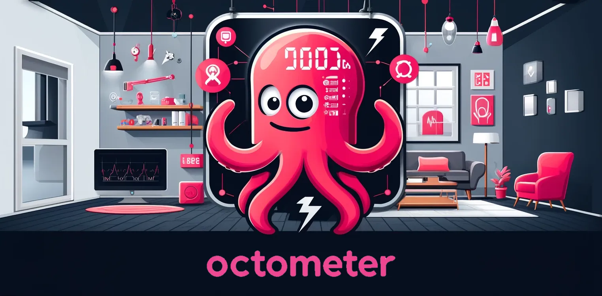

## _Project Kunigami_ /  OctoMeter: Empowering Smart Electricity Usage  

### Production-grade Kotlin Multiplatform App targeting Android, iOS, Desktop

 

 

This app is designed for Octopus Energy customers in the UK who have a smart meter installed. If you don’t have a smart meter, you can still try out the app. It runs in demo mode by default, showing fake user data when authentication is required.

### It works for me

**This is not a sample or demo app**. This is a fully functional app that I developed for myself, and I use it every day to monitor energy consumption and save money. While it should technically work for other Octopus Energy customers, I can’t guarantee it will handle all scenarios such as different tariffs or multiple meter installations. These may produce data that the app cannot process.

This is a dashboard-type app that runs on desktop (desktop-first), Android, and iOS. It supports an adaptive layout that works on mobile, tablet, and dynamic desktop window sizes. The app honours light and dark modes on all supported platforms.

The main purposes of this app are:

* Compile smart meter electricity usage; estimate and project electricity usage and cost.
* Track Octopus Agile tariff unit rates for the coming 24 hours, with countdown and automatic refresh.
* Browse available Octopus Energy tariffs.

For non-Octopus Energy customers, or non-UK residents, the demo mode will display random meter readings and default tariff rates to illustrate the app’s functionality.

The current release meets my daily needs. However, this project will continue to be maintained and improved as a way for me to gain real-world Kotlin Multiplatform development experience. For this reason, the app was intentionally built to reach production-level quality as much as possible.

If you like this app, consider giving me a star, [following me on Medium](https://medium.com/@callmeryan), or [connecting with me on LinkedIn](https://www.linkedin.com/in/ryanwmobile/). 

I am also looking for my next Senior Android Dev role, too.

  

## Switch to Octopus!

* Learn more about the [Agile Octopus](https://octopus.energy/smart/agile/) smart tariff, or other available Octopus tariffs shown in this App.
* Switch to Octopus Energy using [this link](https://share.octopus.energy/best-shell-168), both of us will get £50 (or £100 for business).

  

## To-do lists

Planned enhancements are logged as [issues](https://github.com/ryanw-mobile/OctoMeter/issues).

### Current limitations

There are the known issues to be sorted, since they are not affecting me, it will be queued to be
improved later:

* Dual-rate tariffs (day unit rate and night unit rates) are not fully-supported
* Native iOS UI theming (reusing Android Material 3 components right now)
* British Daylight Saving Time issues: We do not have sufficient test data yet.
* iOS: Slow first time launch
* iOS: Slow screen recomposition when screen orientation changes
* iOS: Agile chart sometimes does not refresh

  

## Running the app

I use Android Studio Koala to build the Android and Deskop apps. Xcode 15.4 for iOS.

* Android: You can download the apk from the [Release Section](https://github.com/ryanw-mobile/OctoMeter/releases).
* iOS: We are setting up TestFlight closed testing. Send your TestFlight Apple ID to `kunigami(at)rwmobi.com` for time-limited testing. We may have to revoke access due to the 100 testers limitation.
* To run the desktop app, execute `./gradlew runReleaseDistrubutable` or just `./gradlew run`
* To export the desktop app into MacOS distributable, execute `./gradlew packageDmg` (I don't use
  Windows)
* You can't export the Jar alone. To export the Jar for desktop. Jar doesn't comes with the native
  Skiko library so it won't run.

  

## Some technical details

* `/composeApp` is for Kotlin code shared across the Compose Multiplatform application.
  It contains several subfolders:
    - `commonMain` is for code that’s common for all targets.
    - `androidMain` is the traditional Android project root.
    - `desktopMain` is for the desktop (JVM) app.
    - `iosMain` is for the Kotlin code to be exposed to the iOS app.

* `/iosApp` contains the iOS application. Open `OctoMeter.xcworkspace` to build the App.

### Dependencies

* [Kermit](https://github.com/touchlab/Kermit) - Apache 2.0 - A Kotlin Multiplatform logging library
* [KoalaPlot](https://github.com/koalaplot/koalaplot-core) - MIT - A plotting library for Kotlin Multiplatform
* [Jetpack Compose](https://developer.android.com/jetpack/androidx/releases/compose) - Apache 2.0 - Modern toolkit for building native UI
* [AndroidX](https://developer.android.com/jetpack/androidx) - Apache 2.0 - AndroidX libraries
* [Kotlinx](https://github.com/Kotlin) - Apache 2.0 - Kotlin extensions and libraries
* [Ktor](https://ktor.io/) - Apache 2.0 - Framework for building asynchronous servers and clients in connected systems
* [Kotest](https://kotest.io/) - Apache 2.0 - Kotlin test framework
* [Material3](https://github.com/material-components/material-components-android) - Apache 2.0 - Material Design components
* [Koin](https://insert-koin.io/) - Apache 2.0 - Dependency Injection framework for Kotlin
* [LeakCanary](https://square.github.io/leakcanary/) - Apache 2.0 - A memory leak detection library for Android
* [Multiplatform Settings](https://github.com/russhwolf/multiplatform-settings) - Apache 2.0 - Multiplatform settings library for Kotlin
* [Theme Detector](https://github.com/Dansoftowner/jSystemThemeDetector) - MIT - Detect system theme (light/dark mode)

### Plugins

* [Android Application Plugin](https://developer.android.com/studio/build/gradle-plugin-3-0-0-migration) - Google - Plugin for building Android applications
* [Android Library Plugin](https://developer.android.com/studio/build/gradle-plugin-3-0-0-migration) - Google - Plugin for building Android libraries
* [Jetbrains Compose Plugin](https://github.com/JetBrains/compose-jb) - JetBrains - Plugin for Jetpack Compose
* [Kotlin Multiplatform Plugin](https://kotlinlang.org/docs/multiplatform.html) - JetBrains - Plugin for Kotlin Multiplatform projects
* [Kover Plugin](https://github.com/Kotlin/kotlinx-kover) - JetBrains - Code coverage tool for Kotlin
* [Ktlint Plugin](https://github.com/JLLeitschuh/ktlint-gradle) - JLLeitschuh - Plugin for Kotlin linter
* [Serialization Plugin](https://github.com/Kotlin/kotlinx.serialization) - JetBrains - Plugin for Kotlin serialization
* [Kotlin JVM Plugin](https://kotlinlang.org/docs/gradle.html) - JetBrains - Plugin for Kotlin JVM projects
* [BuildConfig Plugin](https://github.com/gmazzo/gradle-buildconfig-plugin) - gmazzo - Plugin for generating BuildConfig classes
* [Android Test Plugin](https://developer.android.com/studio/test) - Google - Plugin for Android testing
* [Baseline Profile Plugin](https://developer.android.com/studio/profile/baselineprofile) - AndroidX - Plugin for generating baseline profiles

  

## Data Security and Privacy

First thing first: This app can run under the demo mode without requiring any credentials.

To pull real smart meter data from your Octopus Energy account, you need to generate an API key for
your account
at [https://octopus.energy/dashboard/new/accounts/personal-details/api-access](https://octopus.energy/dashboard/new/accounts/personal-details/api-access).
This app never asks for your Octopus customer account password, and you can always generate a new
API key to invalidate the old keys.

This app stores your API key, account number, MPAN and meter serial number
using `EncryptedSharedPreferences` on Android, or the Keychain on iOS. On desktop, these credentials
are currently unencrypted, but expected to do so when the library we use supports it.

  

## License

This project is licensed under the Mozilla Public License Version 2.0 (MPL-2.0) with a non-commercial clause. See the [LICENSE](./LICENSE) file for details.
